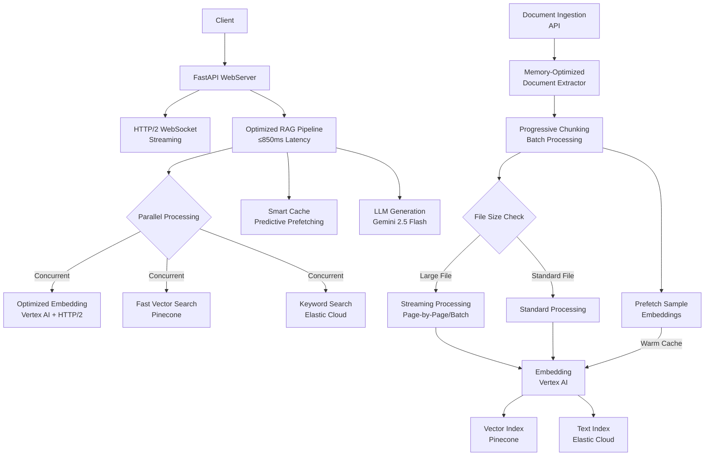

# Ultra-Low Latency RAG Microservice

A high-performance, streaming Retrieval-Augmented Generation (RAG) microservice built for Google Cloud Platform with optimizations for sub-850ms latency and large file processing.

## Features

- **Ultra-Low Latency**: Optimized for ≤850ms P99 latency to first token (reduced from 1000ms)
- **Large File Processing**: Memory-efficient streaming for files of any size
- **Parallel Processing**: Concurrent vector and keyword search with progressive tokenization
- **Streaming**: High-performance SSE and WebSocket implementations with HTTP/2
- **Powerful LLM**: Optimized Vertex AI Gemini 2.5 Flash model integration with connection pre-warming
- **Smart Caching**: Predictive embedding prefetching and background cache maintenance
- **Vector Search**: Enhanced Pinecone integration with parallel query execution
- **Optional Keyword Search**: Elastic Cloud integration for hybrid search
- **Document Processing**: Progressive chunking for large documents with batch processing
- **Observability**: OpenTelemetry metrics, Cloud Trace, and Cloud Profiler
- **Infrastructure as Code**: Complete Terraform configuration
- **CI/CD**: Cloud Build integration for continuous deployment

## Architecture



### Optimization Highlights

- **Parallel Retrieval**: Concurrent embedding generation, vector search, and keyword search
- **Progressive Tokenization**: Memory-efficient processing for extremely large documents
- **Smart Caching**: Predictive prefetching of embeddings for frequently accessed content
- **HTTP/2 Multiplexing**: Improved connection handling for embedding requests
- **Progressive Results**: Fast initial results for time-to-first-token optimization

### Infrastructure Architecture

```
┌────────────┐   GCS Event   ┌─────────────┐
│  GCS       │───Trigger────▶│ Cloud       │
│  Bucket    │               │ Function    │──────┐
└────────────┘               └─────────────┘      │
                                                  │
                                                  ▼
┌────────────┐              ┌─────────────┐    ┌─────────┐
│  Client    │──Request────▶│ Cloud Run   │◀───│ Pinecone│
│  Apps      │              │ Service     │    └─────────┘
└────────────┘              └─────────────┘       │
                                    │              │
                                    ▼              ▼
                              ┌─────────────┐   ┌──────────┐
                              │ Vertex AI   │   │ Elastic  │
                              │ Gemini      │   │ Cloud    │
                              └─────────────┘   └──────────┘
```

## Performance Optimizations

### Large File Processing

The system now includes several optimizations for handling files of any size efficiently:

- **Progressive Chunking**: Large documents (>100MB) are processed using a streaming approach that handles content in manageable batches
- **Memory-Efficient PDF Processing**: Large PDFs are processed page-by-page using Apache Tika to prevent memory issues
- **Batch Processing**: Non-PDF documents are processed in 5MB chunks with proper garbage collection between batches
- **Sample Prefetching**: Automatically prefetches embeddings for a representative sample of chunks to warm up caches

### Low Latency Optimizations

- **Parallel Retrieval**: Performs embedding generation, vector search, and keyword search concurrently
- **HTTP/2 Multiplexing**: Optimized connection handling for embedding API requests
- **Connection Pre-warming**: Establishes connections early to eliminate cold start latency
- **Time to First Token**: Priority given to delivering initial results quickly, with comprehensive results following
- **Background Cache Maintenance**: Periodically cleans prefetch cache to prevent memory bloat

## API Endpoints

- **GET `/health`**: Health check endpoint
- **POST `/query`**: Query documents and get an answer (non-streaming)
- **GET `/chat/sse`**: Chat with documents via Server-Sent Events (streaming)
- **WebSocket `/ws/chat`**: Chat with documents via WebSockets (streaming)
- **POST `/ingest`**: Manually ingest document chunks
- **GET `/docs`**: OpenAPI documentation

## Setup

### Prerequisites

- Google Cloud CLI (`gcloud`)
- Terraform v1.0.0+
- Docker
- A Google Cloud Project with Vertex AI API enabled
- Pinecone account
- (Optional) Elastic Cloud account

### Local Development

1. Clone the repository
   ```bash
   git clone https://github.com/yourusername/rag-microservice.git
   cd rag-microservice
   ```

2. Create a Python virtual environment
   ```bash
   python -m venv venv
   source venv/bin/activate  # Linux/Mac
   pip install -r requirements.txt
   ```

3. Set Environment Variables

### Core Configuration

| Variable Name | Description | Default |
| ------------- | ----------- | ------- |
| `GEMINI_PROJECT_ID` | Google Cloud project ID for Vertex AI | *Required* |
| `GEMINI_LOCATION` | Google Cloud region for Vertex AI | `us-central1` |
| `GEMINI_MODEL_NAME` | Gemini model name | `gemini-2.5-flash` |
| `GEMINI_EMBEDDING_MODEL` | Embedding model name | `text-embedding-004` |
| `PINECONE_API_KEY` | API key for Pinecone | *Required* |
| `PINECONE_ENVIRONMENT` | Pinecone environment | *Required* |
| `PINECONE_INDEX` | Pinecone index name | *Required* |
| `ELASTIC_CLOUD_ID` | Elastic Cloud ID | Optional |
| `ELASTIC_API_KEY` | Elastic API Key | Optional |
| `ELASTIC_INDEX` | Elastic index name | Optional |

### Performance Optimization Flags

| Variable Name | Description | Default |
| ------------- | ----------- | ------- |
| `USE_PARALLEL_RETRIEVAL` | Enable parallel retrieval from vector and keyword stores | `True` |
| `PRIORITIZE_TTFT` | Prioritize time to first token over comprehensive results | `True` |
| `USE_PROGRESSIVE_TOKENIZATION` | Use progressive tokenization for large files | `True` |
| `MAX_CONCURRENT_REQUESTS` | Maximum concurrent embedding requests | `20` |
| `EMBEDDING_TIMEOUT` | Timeout for embedding requests in seconds | `15` |
| `MIN_INSTANCES` | Minimum number of Cloud Run instances | `2` |

   ```bash
   export GEMINI_PROJECT_ID="your-gcp-project"
   export GEMINI_LOCATION="us-central1"
   export GEMINI_MODEL_NAME="gemini-2.5-flash"
   export GEMINI_EMBEDDING_MODEL="text-embedding-004"
   export PINECONE_API_KEY="your-pinecone-api-key"
   export PINECONE_ENVIRONMENT="us-central1-gcp"
   export PINECONE_INDEX="rag-index"
   # Optional Elastic settings
   export ELASTIC_CLOUD_ID="your-elastic-cloud-id"
   export ELASTIC_API_KEY="your-elastic-api-key"
   export ELASTIC_INDEX="your-elastic-index"
   # Performance optimization flags
   export USE_PARALLEL_RETRIEVAL="True"
   export PRIORITIZE_TTFT="True"
   export USE_PROGRESSIVE_TOKENIZATION="True"
   export MAX_CONCURRENT_REQUESTS="20"
   export EMBEDDING_TIMEOUT="15"
   export MIN_INSTANCES="2"
   ```

4. Run the API locally
   ```bash
   uvicorn app.api:app --reload --port 8080
   ```

### Running Tests

```bash
# Unit tests
pytest tests/test_embeddings.py tests/test_api.py

# Performance tests
python -m tests.benchmark_latency --target http://localhost:8080 --threshold 850

# Load tests with Locust
locust -f tests/locustfile.py --host http://localhost:8080
```

## Deployment

### Using Terraform Directly

1. Navigate to the `infra` directory
   ```bash
   cd infra
   ```

2. Initialize Terraform
   ```bash
   terraform init
   ```

3. Plan the deployment
   ```bash
   terraform plan -var="project_id=your-gcp-project" \
     -var="pinecone_api_key=your-pinecone-api-key" \
     -var="pinecone_env=us-central1-gcp"
   ```

4. Apply the configuration
   ```bash
   terraform apply -var="project_id=your-gcp-project" \
     -var="pinecone_api_key=your-pinecone-api-key" \
     -var="pinecone_env=us-central1-gcp"
   ```

### Using Make

A `Makefile` is provided for convenient deployment:

```bash
# Build the Docker image and deploy to GCP
make deploy

# Just build the Docker image
make build

# Clean up resources
make clean
```

## Ingesting Documents

Documents can be ingested in two ways:

1. **Upload to GCS Bucket**: Simply upload files to the created GCS bucket, and the Cloud Function will automatically process and add them to the vector store.

2. **Use the `/ingest` API Endpoint**: Directly call the API to ingest document chunks.

## Performance Monitoring

- Check Cloud Run metrics in the GCP Console
- View custom OpenTelemetry metrics in the provided dashboard
- Monitor P99 latency to first token (TTFT) via Cloud Monitoring

## Contributing

1. Fork the repository
2. Create a feature branch
3. Make your changes
4. Submit a pull request

## License

This project is licensed under the MIT License - see the LICENSE file for details.
